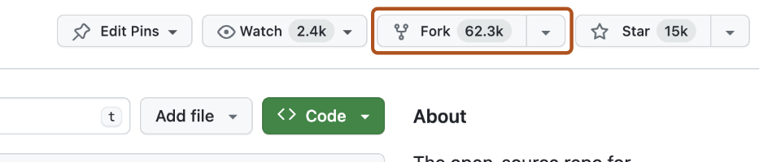
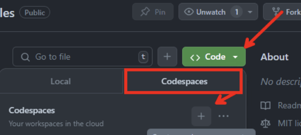

# OpenTelemetry Workshop

Welcome to the **OpenTelemetry Workshop**! This workshop is designed to help you get started with observability using OpenTelemetry across various services.

## 🚀 Workshop Prerequisites

Before we begin, please ensure you have completed the following steps:

---

## ✅ Step 1: Create a GitHub Account (if you don’t have one)

GitHub is a platform for hosting and sharing code. You'll need an account to participate in this workshop.

1. Go to [https://github.com/](https://github.com/)
2. Click on the **Sign up** button (top right).
3. Follow the prompts to:
   - Enter your email address
   - Choose a username
   - Set a password
   - Verify your email
4. Choose the free plan (unless you have access to a paid plan).

Once signed up, log in to your account.

---

## ✅ Step 2: Fork the Workshop Repository

You need your own copy of the repository to work on during the workshop.

1. Visit the official workshop repository:  
   👉 [https://github.com/Hemangii/opentelemetry-workshop](https://github.com/Hemangii/opentelemetry-workshop)

2. Click the **Fork** button (top right of the page).  
   

3. GitHub will create a copy of the repository under your account. You will be redirected to:  
   `https://github.com/<your-username>/opentelemetry-workshop`

   > Example: If your username is `alexdev`, your forked repo will be:  
   > `https://github.com/alexdev/opentelemetry-workshop`

---

## ✅ Step 3: Open the Project in GitHub Codespaces

We’ll use **GitHub Codespaces** so you don’t need to install anything locally. It gives you a full development environment in the browser.

> **Important:** Codespaces is available for free on GitHub Free for individual accounts, with some usage limits. Make sure you’re signed into GitHub.

### To open in Codespaces:

1. Go to **your forked repository** (e.g., `https://github.com/<your-username>/opentelemetry-workshop`)
2. Click on the **Code** button (green button)
  

3. Select the **Codespaces** tab
4. Click **“Create codespace on main”**

   

5. Wait a minute or two while the environment sets up (this may take a bit the first time).

Once it's ready, you’ll have a full VS Code-like environment in your browser with all the project files pre-loaded.
---

## ❓ Need Help?

If you run into issues:

- Ensure you have a GitHub account and are logged in
- Make sure you forked the repository first
- Refresh the page if Codespaces fails to load
- Ask a workshop mentor for assistance
- And if you’re still stuck—no worries! We’ll figure it out together during the workshop. 💡✨
---

## 🎯 You're Ready!

Once your Codespace is open, wait for the instructor to walk you through the next steps.

Let’s build some observable systems together — no installs, no stress! 🚀